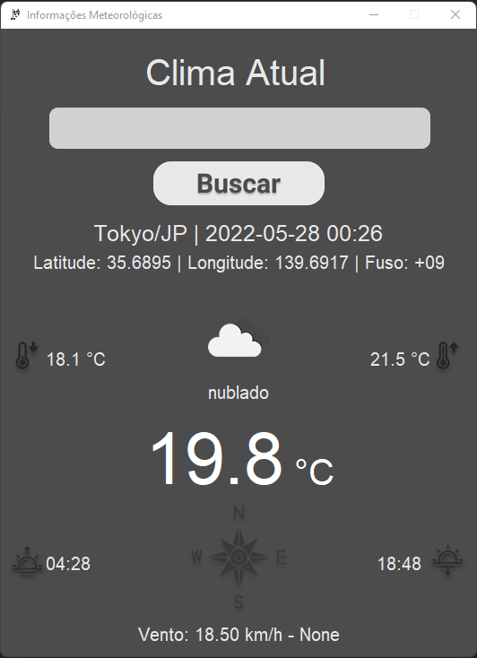

# Projeto/Estudo de OOP — Informações Meteorologicas

## Índice

<a href="#objetivo">Objetivo</a>&nbsp;&nbsp;&nbsp;&nbsp;
<a href="#como-funciona">Como funciona</a>&nbsp;&nbsp;&nbsp;&nbsp;
<a href="#resultados">Resultados</a>&nbsp;&nbsp;&nbsp;&nbsp;
<a href="#referências">Referências</a>&nbsp;&nbsp;&nbsp;&nbsp;

---

## Objetivo

O projeto consiste em um estudo de OOP, com a finalidade de aprender a utilizar
a linguagem Python.

A ideia surgiu a partir do
tutorial [Getting Weather Information](https://www.youtube.com/watch?v=SqvVm3QiQVk&t=1494s)
do youtuber Code With Tomi.

[🔝](#índice)

## Como funciona

A API do OpenWeatherMap é utilizada para obter os dados meteorologicos.

A APP tem uma classe chamada "InformacoesMeteorologicas", que possui um método
chamado "obter_informacoes()", que retorna um dicionário com os dados
meteorologicos formatados.

A classe "Conversores" é utilizada para converter graus em direção cardinal,
bem como para retirar acentos e caracteres especiais com seus respectivos
métodos: "direcao_cardinal()" e "retirar_acentos()".

Uma “interface” gráfica (Tkinter) é utilizada para mostrar os dados
meteorologicos.

Resumo:

- Classe Conversores:
    - direcao_cardinal()
    - retirar_acentos()
- Classe InformacoesMeteorologicas:
    - obter_informacoes()
- gui (interface gráfica):
    - Função show_info_meteorologicas()
- API:
    - OpenWeatherMap

Ao digitar um nome de uma cidade no campo de texto, a APP busca os dados
meteorologicos da cidade e mostra na "interface" gráfica.

[🔝](#índice)

## Resultados

* Teste de contraste da paleta de cores:

  * 

* A captura da tela do aplicativo abaixo mostra a interface gráfica, com os dados
meteorológicos.

  * 

[🔝](#índice)

## Referências

* [Getting Weather Information](https://www.youtube.com/watch?v=SqvVm3QiQVk&t=1494s)
* [OpenWeatherMap API](https://openweathermap.org/current#name)
* [python-decouple 3.6](https://pypi.org/project/python-decouple/)
* [Figma](https://www.figma.com/)
* [Tutorial Figma com Gabriel Silvestri](https://www.youtube.com/watch?v=5rEWrhYRBqw)
* [Tkinter](https://github.com/ParthJadhav/Tkinter-Designer/blob/master/docs/instructions.md)
* [Direção Cardinal](https://pt.wikipedia.org/wiki/Dire%C3%A7%C3%A3o_cardinal)
* [Acentos em Python](https://docs.python.org/3/library/unicodedata.html)
