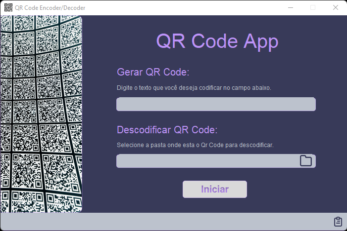

# Projeto/Estudo de OOP — QR Code Encoder Decoder

## Índice

<a href="#objetivo">Objetivo</a>&nbsp;&nbsp;&nbsp;&nbsp;
<a href="#como-funciona">Como funciona</a>&nbsp;&nbsp;&nbsp;&nbsp;
<a href="#resultado">Resultado</a>&nbsp;&nbsp;&nbsp;&nbsp;
<a href="#referências">Referências</a>&nbsp;&nbsp;&nbsp;&nbsp;

---

## Objetivo

O projeto consiste em um estudo de OOP, com a finalidade de aprender a utilizar
a linguagem Python.

A ideia surgiu a partir do
tutorial [QR Code With Python](https://www.youtube.com/watch?v=SqvVm3QiQVk&t=3192s)
do youtuber Code With Tomi.

[🔝](#índice)

## Como funciona

A aplicação permite a criação de códigos QR e também a decodificação deles.

O usuário pode digitar/colar o texto no campo 'Gerar QR Code' e clicar no
botão 'Iniciar'. O arquivo será gerado e a imagem será arquivada no diretório 'src/OOP/qr_code_encoder_decoder/assets'.

Para descodificar um qr code basta clicar no ícone ;
selecionar o arquivo desejado e, após isso, clicar no botão 'Iniciar'. O texto será
mostrado no campo que fica no rodapé do aplicativo.

O ícone ‘clipboard’ , que esta no rodapé à direita, permite copiar o texto para a área de transferência do
sistema.

Caso o usuário clicar no botão 'Iniciar' sem preencher nenhum dos campos, uma
mensagem de erro será exibida.

O mesmo acontece quando o usuário tentar preencher os dois campos.

A aplicação é composta por três classes:

* Classe abstrata Utilitarios;
    * Método estático caminho_relativo_assets();
    * Método estático gerar_nome_arquivo_qr_code();
* Classe QRCodeEncoder;
    * Método gerar_qr_code();
* Classe QRCodeDecoder;
    * Método descodificar_qr_code();

A disposição da ‘interface’ foi desenvolvida no [Figma](https://www.figma.com/) sendo gerada, para o
projeto,
com o
aplicativo [Tkinter Designer](https://github.com/ParthJadhav/Tkinter-Designer) (tanks to [Parth Jadhav](https://github.com/ParthJadhav)), o arquivo
gui.py.

A paleta de cores foi inspirada no tema [Drácula](https://draculatheme.com/)
do [Zeno Rocha](https://zenorocha.com/about)

A foto com vários QR codes, à esquerda do aplicativo, é de autoria do [Mitya Ivanov](https://bit.ly/3wWrOL3).

[🔝](#índice)

## Resultado

[🔝](#índice)

## Referências

* [QR Code With Python](https://www.youtube.com/watch?v=SqvVm3QiQVk&t=3192s)
* [Tkinter Designer](https://github.com/ParthJadhav/Tkinter-Designer)
* [Figma](https://www.figma.com/)
* [Dracula Theme](https://draculatheme.com/)